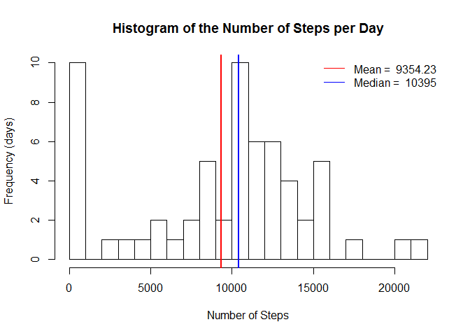
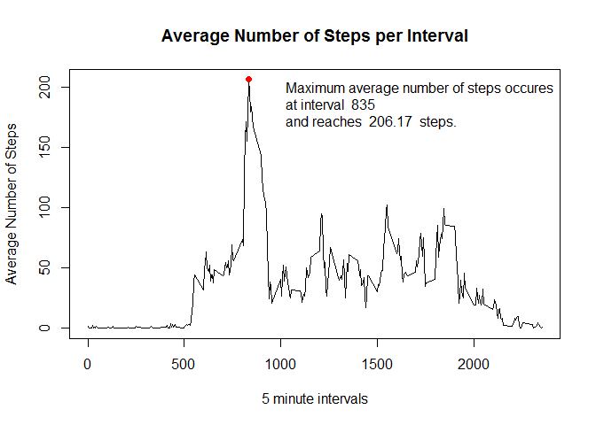
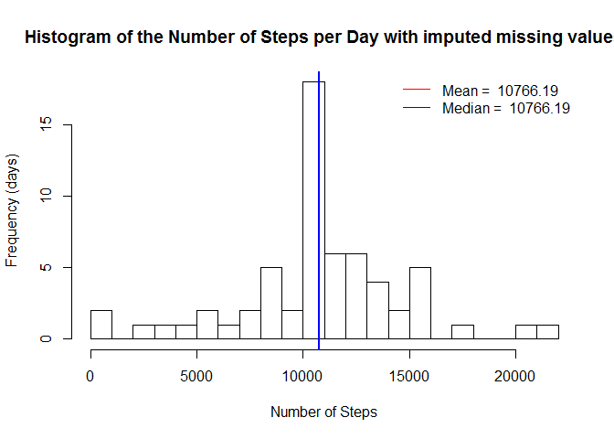
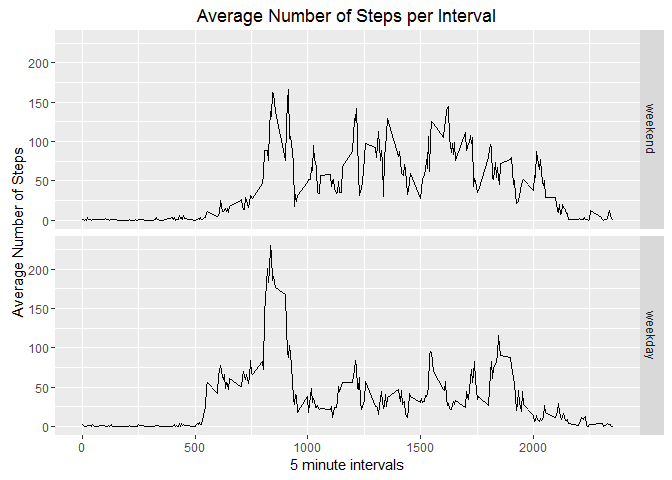

# Reproducible Research: Peer Assessment 1
Vera Boguslavskaya  
April 17, 2016  


## Loading and preprocessing the data

```r
## Load packages
library(dplyr)
```

```
## 
## Attaching package: 'dplyr'
```

```
## The following objects are masked from 'package:stats':
## 
##     filter, lag
```

```
## The following objects are masked from 'package:base':
## 
##     intersect, setdiff, setequal, union
```

```r
library(chron)
library(ggplot2)
## Read data into R
activity <- read.csv("activity.csv")
## convert dates into Date format
activity$date <- as.Date(as.character(activity$date))
```


## What is mean total number of steps taken per day?
To calculate the mean we group the data by day, then calculate the total number 
of steps for each day. At this point we just ignore the missing values. 

```r
## calculate total number of steps per day
by_day <- summarise(group_by(activity, date), steps = sum(steps, na.rm = TRUE))
## Create a histogram of steps per day with mean and median
hist(by_day$steps, breaks = 20, main = "Histogram of the Number of Steps per Day", 
     xlab = "Number of Steps", ylab = "Frequency (days)")
abline(v = mean(by_day$steps, na.rm = TRUE), col = "red", lwd = 2)
abline(v = median(by_day$steps, na.rm = TRUE), col = "blue", lwd = 2)
legend("topright", c(paste ("Mean = ", round(mean(by_day$steps, na.rm = TRUE), 2)), 
                     paste("Median = ", median(by_day$steps, na.rm = TRUE))),
       lty= c (1,1), col = c("red", "blue"), bty = "n")
```



## What is the average daily activity pattern?
To calculate the average daily activity pattern we group the data by interval, 
then calculate the total number of steps for each interval. 
At this point we just ignore the missing values. 

```r
## calculate total number of steps per interval
by_interval <- summarise(group_by(activity, interval), steps = mean(steps, na.rm = TRUE))
## Create a line plot of avarage number of steps per interval
with(by_interval, plot(interval, steps, type = "l", main = "Average Number of Steps per Interval", xlab = "5 minute intervals", ylab = "Average Number of Steps"))
## Find the period with the greatest avarage
max_int_steps <- by_interval[ which.max(by_interval$steps),]
## Add maximum point to the plot
points(max_int_steps, col="red", pch=19)
legend("topright", c("Maximum average number of steps occures",
                     paste("at interval ",max_int_steps[1]),
                     paste("and reaches ", round(max_int_steps[2],2), " steps.")), bty = "n")
```



## Imputing missing values
There are 2304 rows with missing values(NA) in the dataset.
To decrease bias introdused by missing values we create new dataset activity1, 
where missing values replased with the avarage for the corresponding interval.


```r
## Create copy of a dataset
activity1 <- activity
## find out indecis of rows containing NA
stepsNA <- which(is.na(activity1$steps), arr.ind = TRUE)
## replace missing values 
for (i in stepsNA) {
        activity1$steps[i] <- by_interval$steps[which(by_interval$interval ==  activity1$interval[i])]
}
## calculate total number of steps per day in a new dataset
by_day1 <- summarise(group_by(activity1, date), steps = sum(steps))
## Create a histogram of steps per day with mean and median with imputed values

hist(by_day1$steps, breaks = 20, main = "Histogram of the Number of Steps per Day with imputed missing values", 
     xlab = "Number of Steps", ylab = "Frequency (days)")
abline(v = mean(by_day1$steps, na.rm = TRUE), col = "red", lwd = 2)
abline(v = median(by_day1$steps, na.rm = TRUE), col = "blue", lwd = 2)
legend("topright", c(paste ("Mean = ", round(mean(by_day1$steps), 2)), 
                     paste("Median = ", round(median(by_day1$steps), 2))),
       lty= c(1,1), col = c("red", "blue"), bty = "n")
```



We can see only one vertical line because the values of mean and median are equal.
If we compare this histogram with the first one, we can see, that both mean and median
incresed. This means that imputing the missing data increased estimates of the number of steps per day.

## Are there differences in activity patterns between weekdays and weekends?
To answer this question we create new coloumn in the dataset with imputed values, to show whether a day is a weekday or a weekend
Then create two line plots to compare dayly activities by interval between weekdays and weekends

```r
activity1$weekDay <- factor(is.weekend(activity1$date), 
                            levels = c(TRUE, FALSE), labels = c('weekend', 'weekday'))
by_interval_wDay <- summarise(group_by(activity1, weekDay,interval), steps = mean(steps))
qplot(interval, steps, data = by_interval_wDay, facets = weekDay ~ ., geom = "line") +
        ggtitle("Average Number of Steps per Interval") + 
        xlab("5 minute intervals") +  ylab("Average Number of Steps")
```


